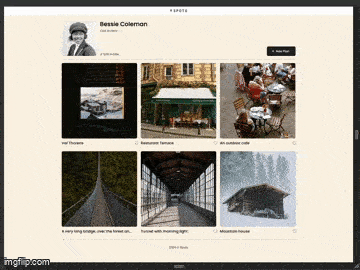

# Project Name: Spots

## Project features // Technology used

Spots is an interactive social media web application where you can add photos, remove photos, like other users pictures, and make a customized profile.
The site was created using HTML and CSS.

- Hover capability
- Flexbox
- Semantic HTMLS
- CSS

## Deployment

When you run this program, you will be able to run a responsive webpage where when you hover over the two buttons they can shades.

## Links

[Link to project Spots on Github pages](https://guccigerm.github.io/se_project_spots/)

[Link to live demo of Spots on loom](https://www.loom.com/share/2ec9d0fc354e402ca26510c0f759b826?sid=48d60543-4fb7-411d-a0f5-091b492c9258)

## Images

